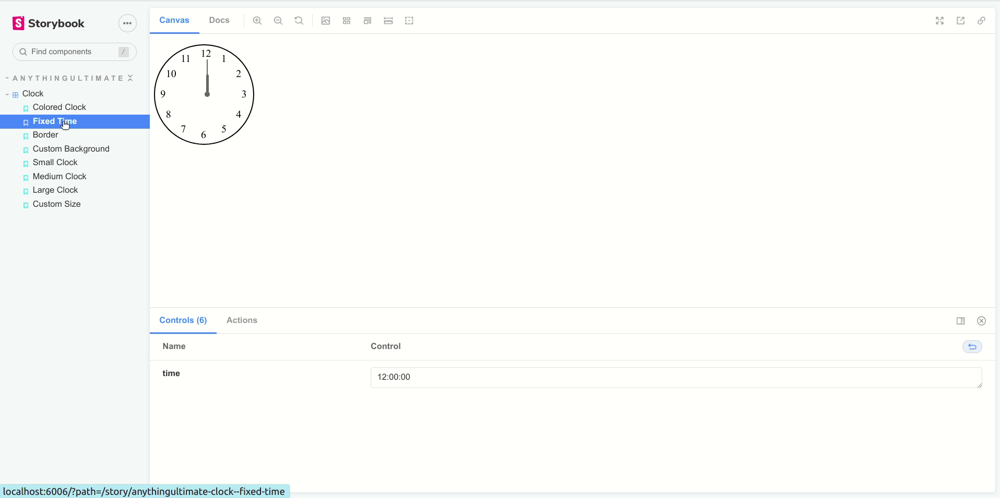

# react-clock-styled

## Installation

```
npm i react-clock-styled
```

then use on your component importing it.

```js
import styled from "styled-components";
import Clock from "react-clock-styled";

const Main = styled.div`
min-height: 100vh;
display:flex;
justify-content:center;
align-items: center;
flex-wrap: wrap;
 .clock{margin: 10px 150px;}
`


function App() {
  return (
    <Main>
    <div className="clock">
    <Clock size="" border="" color="#000957" handleColor="#344CB7" bg="" />
    </div>
    <div className="clock">
    <Clock size="" border="4px dotted" color="" handleColor="" bg="" />
    </div>
    <div className="clock">
    <Clock size="" border="8px solid" color="#94B3FD" handleColor="#FF5DA2" bg="#000D6B" />
    </div>
    <div className="clock">
    <Clock size="sm" border="" color="" handleColor="" bg="" />
    </div>
    </Main>
  );
}

export default App;
```

Result: [https://au-clock.netlify.app/](https://au-clock.netlify.app/)

## Demo

