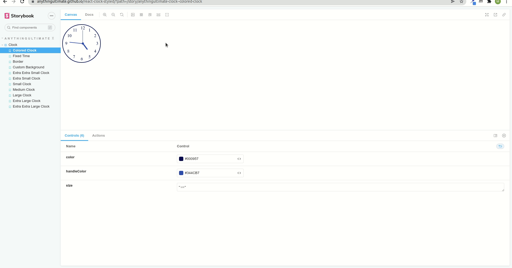

# react-clock-styled

## Installation

```
npm i react-clock-styled
```

then use on your component importing it.

```js
import styled from "styled-components";
import {Clock} from "react-clock-styled";

const Main = styled.div`
min-height: 100vh;
display:flex;
justify-content:center;
align-items: center;
flex-wrap: wrap;
.clock{margin: 10px 150px;}
`


function App() {
  return (
    <Main>
    <div className="clock">
    <Clock size="sm" border="" color="#000957" handleColor="#344CB7" />
    </div>
    <div className="clock">
    <Clock size="sm"  />
    </div>
    <div className="clock">
    <Clock size="sm" border="6px solid" color="#94B3FD" handleColor="#FF5DA2" bg="#000D6B" />
    </div>
    <div className="clock">
    <Clock size="lg" border="4px dashed" />
    </div>
    </Main>
  );
}

export default App;
```
dotted,dashed,solid,double,groove,ridge,inset,outset,none,hidden

Result: [https://au-clock.netlify.app/](https://au-clock.netlify.app/)

## Props:

| prop | values | example |
| :--- | :----- | :----- |
| size | xxs, xs, sm, md, lg, xl, xxl |"xxs", "xs", "sm", "md", "lg", "xl", "xxl" |
| time | hh:mm:ss format |10:00:00  |
| border | xxs, xs, sm, md, lg, xl, xxl | "1px dashed", "2px dotted", "2px solid", "4px double","6px groove","8px ridge","2px inset","2px outset","2px none","2px hidden" |
| bg | background color | "#000D6B" |
| handleColor | handle color | "#FF5DA2" |
| color | text color | "#94B3FD" |

Please consider giving star on my github repo. Thanks.

## Demo

